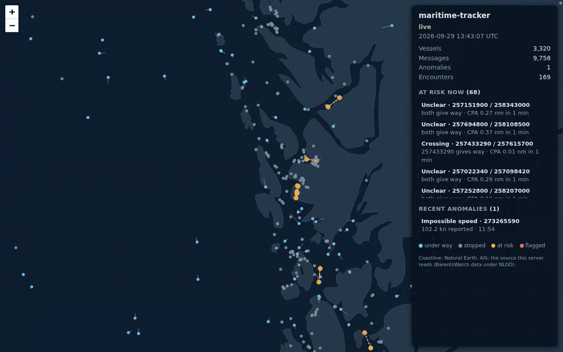

# maritime-tracker

[](https://github.com/fernandojcardenas/maritime-tracker/actions/workflows/ci.yml)

A real-time vessel tracking service in C++20. It turns a raw AIS feed (the
radio messages ships broadcast about their position, course and identity) into
clean tracks, flags suspicious behaviour and scores collision risk.

It runs entirely on public data: no radio hardware is needed. A Raspberry Pi
with an RTL-SDR receiver can be added later as one more input.

**Status:** milestones 1 (decoder), 2 (live ingest and replay), 3 (tracker), 4 (anomalies), 5 (collision risk), 6 (spatial index) and 7 (live map, WebSocket API and Docker image) done. See the [roadmap](docs/roadmap.md).

## Why

I'm a U.S. Coast Guard electronics technician, and marine radio and
navigation are the domain I know best. This project takes that domain into
software: parse untrusted radio data safely, fuse position reports into
tracks, and reason about traffic the way a watchstander does, including which
vessel has to give way.

## What works today (M1: decoder)

- NMEA 0183 parser for `!xxVDM` / `!xxVDO` sentences with checksum
  validation and IEC 62320-1 tag blocks (receiving station, timestamp).
- Reassembly of multi-sentence messages, with a bounded buffer so hostile or
  lossy input can't grow memory without limit.
- Full decoding of message types 1, 2, 3 (Class A position), 5 (static and
  voyage data), 18, 19 (Class B position) and 24 (Class B static data). Other
  valid types are counted by header; undefined message ids are rejected.
- "Not available" sentinel values become empty optionals, and out-of-range
  values are rejected, so later stages never see latitude 91.
- Every rejected line is counted by reason instead of dropped silently.
- `mt-decode`, a command-line tool: raw NMEA in, one JSON object per message
  out, statistics on stderr.

```
$ ./build/mt-decode < testdata/pyais-nmea-sample.nmea > messages.jsonl
lines            85194
sentences ok     85186
messages         82748
unique MMSIs     11075
fragments dropped 4
decode too short 0
decode invalid   0
unknown type     2
parse error bad_fill_bits: 8
by type: 1=61374 2=1973 3=8785 4=4043 5=2221 6=435 8=1082 9=27 10=7 11=28 16=1 17=314 18=1361 19=109 20=276 21=380 22=23 24=307 25=2
```

## Ingest and replay (M2)

`mt-ingest` reads a live feed or a recorded file, decodes it, tracks vessels,
and can record what it receives for later replay.

**One hour of live data** (2026-09-29, 13:39–14:39 UTC, BarentsWatch Live AIS
API, run on GitHub Actions): 132,270 records from 3,752 vessels along the
Norwegian coast, the Barents Sea and Svalbard, about 37 per second, with 0
invalid records and 0 dropped. The tracker ran live on the stream: 4,064 tracks,
127,927 updates, 279 gate rejections. Replaying the recording gives identical
output every time and reproduces those tracker numbers exactly
([run log](docs/evidence/m2-live-run-2026-09-29.txt)).

That run also found a bug. Replaying the hour twice gave two different results,
because file replay was sharing the live feed's drop-oldest queue and silently
lost lines once a file outgrew it. Replay now waits for queue space instead, and
CI replays a 200,000-line file on every push to keep it that way.

```
mt-ingest --tcp 153.44.253.27:5631 --record recordings/        # raw NMEA over TCP, recorded hourly
mt-ingest --replay recordings/ais-20260928-17.nmea --speed 60  # one hour per minute
tools/barentswatch_stream.sh | mt-ingest --stdin --format barentswatch --duration 3600
```

Two live sources carry the same Norwegian open AIS data: the raw NMEA feed
over TCP, and the BarentsWatch Live AIS API over HTTPS (one JSON record per
line). The raw feed did not accept connections from US networks when tested,
so the HTTPS API is the default for live runs. A small script gets the OAuth
token, streams with `curl`, and reconnects with backoff when the stream ends
or the token expires. The C++ side reads its standard input with the same
line limits as the TCP client, so no TLS library is needed in the service.

- **Reconnects forever.** Connect failures, peer closes, read errors and
  silent connections (no bytes for 30 s) all lead to a reconnect with
  exponential backoff and random jitter, capped at 30 s. Each cause is
  counted separately.
- **Bounded everywhere.** Lines over 1,024 bytes are discarded by the framer,
  and a fixed-size queue sits between the network thread and the decoder. If
  decoding falls behind, the oldest lines are dropped and counted instead of
  stalling the socket. File replay waits for space instead, so it never loses
  a line. See [ADR 0002](docs/adr/0002-ingest-threading-and-backpressure.md).
- **Recording and replay.** Recordings rotate hourly and every line gets a
  receive timestamp. Replay paces lines by those timestamps (JSON records by
  their own `msgtime`) at any speed, shortens long outages, and never rewinds
  on out-of-order timestamps. Time is
  injected, so the pacing tests run instantly.

The same checks run against [`tools/fake_barentswatch.py`](tools/fake_barentswatch.py),
a local stand-in for the API: 8,366 records over three token-and-stream cycles,
0 invalid, 0 dropped, identical replays, and the secret in no log
([output](docs/evidence/m2-barentswatch-fake-run.txt)). CI repeats that test
on every push.

A local run against [`tools/fake_feed.py`](tools/fake_feed.py), which serves
recorded traffic in split chunks and drops the connection every 3,034 lines:
all 9,102 lines arrived across 3 connections, 0 were dropped, and replaying the
recording produced exactly the same decoded messages as decoding the source
file directly. Full output: [docs/evidence/m2-fake-feed-run.txt](docs/evidence/m2-fake-feed-run.txt).

## Tracker (M3)

Each vessel gets a constant-velocity Kalman filter that fuses reported
position with reported speed and course, and gates out reports that are
statistically implausible for the track ([ADR 0003](docs/adr/0003-tracker-design.md)).

It was evaluated on 144,414 real reports from 411 vessels in the Øresund
strait (Danish AIS data, 2026-04-22), tuned on one hour and tested on the
next. Median / 90th percentile error predicting a moving vessel's next
position 10–30 s ahead:

| Input | Hold last position | Dead reckoning | Kalman filter |
|---|---:|---:|---:|
| Clean | 53 / 83 m | **2 / 12 m** | 3 / 12 m |
| 15 m noise, 30% without speed/course | 54 / 93 m | 24 / 67 m | **6 / 22 m** |

On clean AIS, dead reckoning from the last report is already excellent and
the filter doesn't beat it. With degraded input the filter is about four
times more accurate. The gate also rejects about 89% of injected wild
reports. Full method, all horizons, the trade-offs and one known weakness
(long silences) are in the [tracker evaluation](docs/tracker-evaluation.md).

```
tools/fetch_dk_slice.sh data/oresund.csv          # 830 MB download, SHA-256 checked
./build/mt-track --dk-csv data/oresund.csv --eval-from 1776862800 --eval-to 1776866400 --pos-sigma 5
```

## Anomalies (M4)

The detector flags four kinds of behaviour, each a physical limit that a
person can check by hand ([ADR 0004](docs/adr/0004-anomaly-rules.md)):

| Flag | Raised when |
|---|---|
| Impossible speed | The vessel reports more than 50 kn |
| Position jump | The vessel is farther from its last position than it could have travelled |
| Gap | A vessel that was moving and heard regularly goes quiet for 10 minutes while the receivers are working |
| Identity conflict | One MMSI keeps reporting from two places that cannot both be right: two transmitters, one identity |

It was evaluated on four slices of real Danish traffic by planting 100
labelled cases of each kind into each slice (seeded, reproducible) and
counting how many it finds. The last slice was run once, after the rules were
frozen:

| Planted case | Øresund | Great Belt | Skagen | Bornholm (hold-out) |
|---|---:|---:|---:|---:|
| Impossible speed (55–100 kn) | 100% | 100% | 100% | 100% |
| Position jump (3–30 km) | 100% | 100% | 100% | 100% |
| Gap (15–40 min) | 97% | 82%\* | 100% | 100% |
| Identity conflict (second transmitter 5+ km away) | 98% | 99% | 99% | 100% |
| Flags on the data as recorded | 5 | 1 | 4 | 0 |

\* Every missed gap on the Great Belt overlaps a 10-minute receiver outage in
that slice; silence while the receivers are down is not counted, by design.

The real flags are the faults and habits real AIS contains: harbour boats
switching off at the quay, a GPS glitch, a fishing vessel reporting 65.7 kn.
Real data also shaped the rules. A receiver outage made 10 vessels "go dark"
at once. Three search-and-rescue helicopters produced 67 speed and jump flags
in the live hour. Satellite passes made dozens of Arctic vessels "reappear"
together. Each is now handled by an explicit rule, with a test. Detection
has limits: jumps under about 2 km between sparse reports are often
physically possible, so only half of 0.5–1 km jumps are found. The
[anomaly evaluation](docs/anomaly-evaluation.md) has the method, every flag
explained, the sensitivity tables and the limitations.

The detector also runs live inside `mt-ingest`. On the one-hour Norwegian
recording it raises 2 speed flags and 13 gaps, down from 199 flags before
those rules. It gives the same result on the stream in arrival order as the
offline tool gives on sorted data.

```
tools/fetch_dk_slice.sh data/oresund-2026-04-22.csv data/    # all four slices
tools/evaluate_anomalies.sh build/mt-anomaly data/
tools/barentswatch_stream.sh | mt-ingest --stdin --format barentswatch --anomalies anomalies.jsonl
```

## Collision risk (M5)

Every minute, every pair of vessels under way gets a closest point of
approach (CPA) and time to it (TCPA). If they will pass within 0.5 nm within
20 minutes, the pair is classified under the COLREGs steering rules and the
vessel that has to keep out of the way is named
([ADR 0005](docs/adr/0005-collision-risk.md)):

| Encounter | Who keeps out of the way |
|---|---|
| Overtaking (Rule 13): coming up from more than 22.5° abaft the beam | The overtaking vessel |
| Head-on (Rule 14): nearly reciprocal courses, each nearly ahead of the other | Both, to starboard |
| Crossing (Rule 15) | The vessel that has the other on her starboard side |

There is no public record of who *should* have given way, so the roles were
checked against what vessels actually did. For each developing encounter
(first at risk at least 1 nm apart and 4 minutes out), each vessel is
credited with how much its own manoeuvring opened the passing distance,
compared with holding its course and speed:

| Encounters (Danish AIS, 2026-04-22) | Give-way vessel opened the distance more than the stand-on vessel |
|---|---:|
| Overtaking, Øresund | 15 of 17 |
| Crossing, commercial vessels, Great Belt and Skagen | 7 of 9 (9 of 9 within 0.25 nm) |
| Crossing, all vessel types, Great Belt and Skagen | 12 of 27 |
| Crossing, Øresund | 42 of 77 |

Overtaking and open-water crossings between commercial vessels behave as
the rules say. With fishing vessels, pilot boats and tugs included, crossings
are near a coin toss, which fits Rule 18: vessels fishing or restricted in
their ability to manoeuvre have right of way whatever the geometry. That
split was added after seeing the data and is labelled as such. Øresund
crossings are mostly harbour boats and a ferry route where local practice
decides. The predicted CPA is within 41 m (median) of the real pass at 0–2
minutes and 156 m at 2–5 minutes; further out the vessels' own avoiding
action is most of the difference. The [collision-risk evaluation](docs/collision-risk-evaluation.md)
has the method, all the tables and the limitations.

`mt-ingest` assesses risk live: the one-hour Norwegian recording yields
2,020 encounters, and the whole hour (tracking, anomalies and risk) replays
in 1.4 seconds.

```
tools/evaluate_collision_risk.sh build/mt-risk data/
tools/barentswatch_stream.sh | mt-ingest --stdin --format barentswatch --encounters encounters.jsonl
```

## Spatial index (M6)

Collision risk needs every pair of vessels within 6 nm, every minute. Four
ways of finding them were built and measured: brute force, a sweep over
latitude, a uniform grid and a k-d tree, the last two in Earth-centred 3D
coordinates so the date line and the poles need no special cases. All four
return identical pairs; tests, a fuzz target and every benchmark run check it
([ADR 0006](docs/adr/0006-spatial-index.md)).

| Vessels at once | Latitude sweep | Grid | k-d tree |
|---|---:|---:|---:|
| 3,752 (the whole Norwegian live hour) | 2.3 ms | 2.2 ms | 4.4 ms |
| 100,000 (global feed, synthetic) | 109 ms | 74 ms | 130 ms |
| 1,000,000 (global feed, synthetic) | 4,354 ms | **1,046 ms** | 1,578 ms |

At real feed sizes any method takes a few milliseconds; at a million vessels
the grid is four times faster than the sweep. Profiling showed that the
largest single cost was not the search but sorting the 11.5 million pairs it
found; a linear-time bucket sort cut the grid's time at a million vessels
from 1.7 s to 1.0 s. A cache-locality change that made no measurable
difference was reverted. In very dense ports brute force is fastest, since
there is little to prune. The [benchmark](docs/spatial-index-benchmark.md)
has every workload, the profile and the limitations.

```
build/mt-bench --dk-csv data/oresund-2026-04-22.csv --barentswatch live.jsonl
build/mt-bench --barentswatch live.jsonl --profile grid 1000000   # time per phase
```

## Live map (M7)



`mt-ingest --serve 8080` serves a live map at http://localhost:8080/: every
tracked vessel with a five-minute course line, the pairs at risk of
collision with who gives way, and anomaly flags, updated once a second. The
recording above is real: `mt-ingest` replaying the one-hour BarentsWatch
recording at 10x off Bergen, in Chromium.

```
docker build -t maritime-tracker .
docker run --rm -p 8080:8080 maritime-tracker                                   # replays the bundled sample
docker run --rm -p 8080:8080 -e BW_CLIENT_ID -e BW_CLIENT_SECRET maritime-tracker  # live Norwegian AIS
```

- **Own HTTP/1.1 and WebSocket server** (RFC 6455, with its own SHA-1 and
  base64), one `poll()` thread, a bounded queue per client: a browser that
  falls behind is disconnected, never the tracker slowed. Tested against the
  published vectors, on real sockets, under ThreadSanitizer and by a fuzz
  target ([ADR 0007](docs/adr/0007-live-map.md)).
- **Snapshot, then deltas:** a new browser gets everything once, then only
  what changed: about 11 KB a second at real time on the Norwegian feed
  ([evidence](docs/evidence/m7-live-map-run-2026-09-29.txt)).
- **One binary, no internet needed:** page, Leaflet and a Natural Earth
  coastline are built into `mt-ingest`. No tile server, no API key.
- **Safe defaults:** bound to 127.0.0.1, limits on clients, request size and
  time, a Content-Security-Policy allowing only the server itself; the
  container runs as non-root.

[docs/live-map.md](docs/live-map.md) has the protocol, the limits, phone
layout and how it's tested.

## How it's tested

| Check | What it proves | Where |
|---|---|---|
| 137 tests (GoogleTest) | Every parser error path, bit-level field decoding, fragment reassembly and eviction; line framing, queue overflow, replay pacing, recorder rotation; geodesy, filter convergence and covariance health, gating, restarts, re-anchoring; JSON records and ISO 8601 times; every anomaly rule and its exceptions (outages, coverage returning, aircraft, repeated transmissions); CPA/TCPA, the COLREGs sectors on both sides of each boundary, and role symmetry over 20,000 random pairs; the four pair-search methods against brute force and an independent great-circle check, at the date line and the poles; SHA-1, base64 and the WebSocket handshake against published vectors, HTTP requests, every frame encoding and bad-frame close code, and the live-map messages | `tests/` |
| Tracker evaluation on real data | Held-out prediction error against two baselines, and outlier rejection; fails CI on regression | `tools/evaluate_tracker.sh`, `evaluate` workflow |
| Anomaly evaluation on real data | Planted anomalies found and false alarms on four slices of Danish traffic; fails CI on regression | `tools/evaluate_anomalies.sh`, `evaluate` workflow |
| Pair-search benchmark | All four methods return identical pairs on real traffic and up to 100,000 vessels; timings in the job summary | `apps/mt-bench`, CI `benchmark` job |
| Collision-risk evaluation on real data | Predicted CPA against the real pass, and COLREGs roles against what vessels did; fails CI on regression | `tools/evaluate_collision_risk.sh`, `evaluate` workflow |
| Fake-feed TCP tests | Split lines, peer disconnect, silent connection, refused connect, prompt shutdown, against a real socket on loopback | `tests/tcp_source_test.cpp` |
| Map server socket tests | Files and 404, upgrade then snapshot then updates, bad frames, a client that stops reading dropped while another keeps receiving, client limit, request timeout, stopping with clients connected | `tests/serve_test.cpp` |
| Docker image | Built, run, and checked from outside: page, files, security header, handshake, snapshot and updates; non-root; clean exit on `docker stop` | `Dockerfile`, `tools/check_live_map.py`, CI `docker` job |
| Recorded-traffic test | Exact counts on 85,194 lines of real AIS, including its malformed sentences | `tests/capture_test.cpp` |
| Cross-check against pyais | Every decoded field of 76,130 messages matches an independent open-source decoder | `tools/crosscheck.py` |
| ASan + UBSan | No memory errors or undefined behaviour, with GCC and Clang | CI `test` job |
| ThreadSanitizer | No data races in the reader thread, queue and TCP client; threaded tests (including the map server's) repeated 20 times | CI `tsan` job |
| Nine libFuzzer targets | Arbitrary bytes into the stream decoder, the message decoders, the line framer under arbitrary TCP chunking, and the parsers for downloaded CSV and streamed JSON; arbitrary report sequences into the anomaly detector; arbitrary positions and velocities into collision risk; every pair-search method against brute force; arbitrary bytes into the HTTP request parser and, in arbitrary chunks, the WebSocket frame parser | `fuzz/`, CI `fuzz` job |
| Live-API bridge test | Token, stream, token expiry, reconnect and clean shutdown against a fake server; the secret must not appear in any output; a 200,000-line replay must lose nothing | CI `barentswatch-bridge` job |
| Live-data test | 5,000 real records from the one-hour live run parse, track and pass the anomaly rules with pinned counts | `tests/barentswatch_test.cpp`, `tests/anomaly_test.cpp` |
| clang-tidy | bugprone, cert, performance, modernize and readability checks, warnings as errors | `.clang-tidy`, CI `lint` job |

The cross-check found four real problems during development, all fixed:
coordinates printed with too few digits (about 0.5 m of precision lost), names
with leading spaces, position reports rejected when a transmitter declared too
many fill bits, and undefined message ids being accepted. One difference is
intentional: this decoder rejects sentences whose fill-bit field is outside
0–5, which pyais accepts.

## Build

Requires CMake 3.24+ and a C++20 compiler (GCC 13, Clang 18 or Apple Clang).
GoogleTest is downloaded at configure time.

```
cmake -S . -B build -DCMAKE_BUILD_TYPE=Release
cmake --build build
ctest --test-dir build
```

Options: `-DMT_SANITIZE=ON` (ASan + UBSan), `-DMT_BUILD_FUZZERS=ON` (Clang
with libFuzzer), `-DMT_WARNINGS_AS_ERRORS=ON`. Or `docker build -t
maritime-tracker .` for the image with the live map.

## Layout

```
include/maritime/   public headers: nmea/, ais/, ingest/, track/, anomaly/, risk/, spatial/, serve/, util/
src/                parser, bit reader, message decoders, stream decoder, ingest (TCP, replay, recorder), tracker, anomaly detector, collision risk, pair search, map server (HTTP, WebSocket, live feed)
apps/mt-decode/     command-line decoder
apps/mt-ingest/     live/replay ingest with recording and the live map
apps/mt-track/      tracker evaluation on recorded traffic
apps/mt-anomaly/    anomaly detection and evaluation on recorded traffic
apps/mt-risk/       collision-risk evaluation on recorded traffic
apps/mt-bench/      pair-search benchmark
web/                live map page, script, style, coastline and vendored Leaflet (built into mt-ingest)
cmake/              build helper that embeds web/ in the binary
docker/             container entrypoint (Dockerfile at the root)
tests/              unit tests and the recorded-traffic test
fuzz/               libFuzzer targets
tools/              cross-check against pyais, fake TCP feed and fake live API, live stream script, data fetch, tracker, anomaly and collision-risk evaluations, coastline builder, live-map check
testdata/           recorded AIS traffic (MIT, from pyais) and 5,000 live records (NLOD)
docs/               roadmap, data sources, architecture decisions, evidence from real runs
```

## Data and scope

All data is public: see [data sources](docs/data-sources.md) and
[testdata](testdata/README.md). Nothing here uses government or military
systems or data. Design decisions are recorded in [docs/adr](docs/adr).

## Licence

MIT. See [LICENSE](LICENSE). Third-party material (Leaflet, Natural Earth,
test data) keeps its own licence; see [THIRD-PARTY.md](THIRD-PARTY.md).
