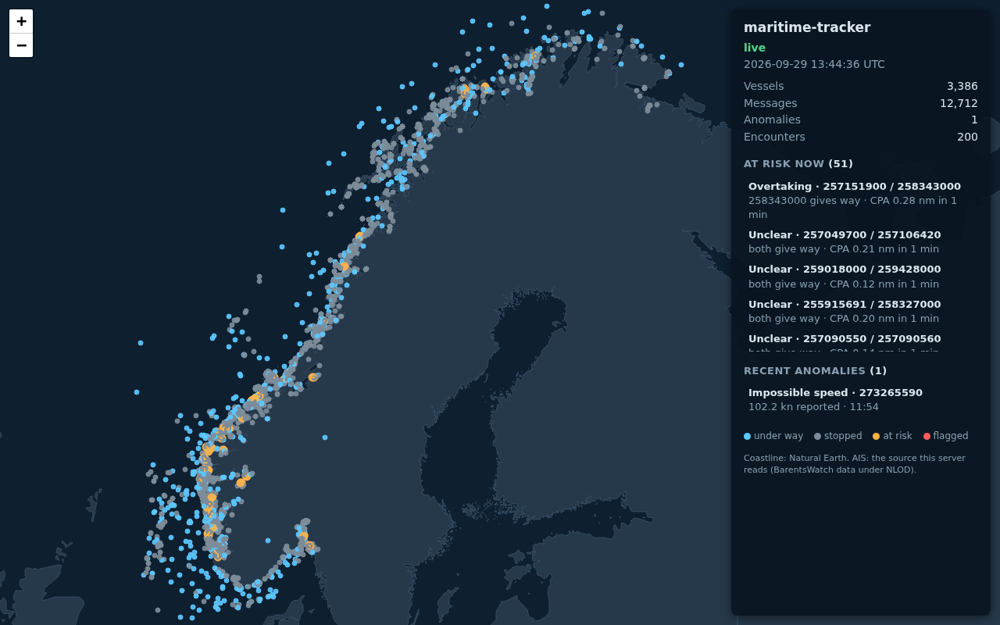
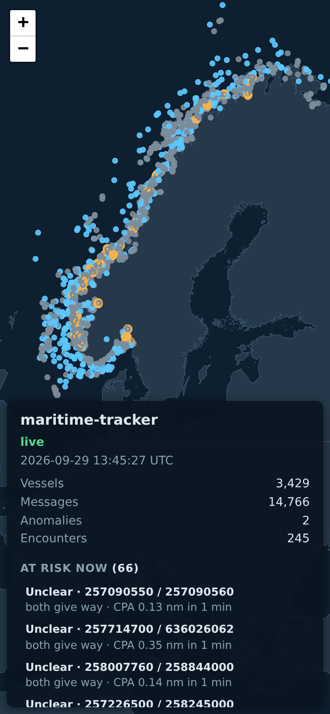

# Live map

`mt-ingest --serve PORT` serves a map of every tracked vessel in the browser,
updated once a second over a WebSocket: positions with a five-minute course
line, pairs at risk of collision (M5), and anomaly flags (M4). The server, the
WebSocket protocol and the page are part of this repository; the binary needs
no web server, no tile server and no internet connection to show the map.


*Recorded from a real run: `mt-ingest` replaying the one-hour BarentsWatch
recording of 2026-09-29 at 10x, viewed in Chromium and captured with
Playwright. Orange: pairs whose closest approach is within 0.5 nm within 20
minutes, joined by a dashed line; blue: under way; grey: stopped.*

## Running it

```
# replay a recording (real time; --speed 10 for faster)
build/mt-ingest --replay live.jsonl --format barentswatch --serve 8080

# live Norwegian AIS (credentials: see data-sources.md)
tools/barentswatch_stream.sh | build/mt-ingest --stdin --format barentswatch --serve 8080

# Docker: replays the bundled 5,000-record sample, or goes live with credentials
docker build -t maritime-tracker .
docker run --rm -p 8080:8080 maritime-tracker
docker run --rm -p 8080:8080 -e BW_CLIENT_ID -e BW_CLIENT_SECRET maritime-tracker
```

Then open http://localhost:8080/. The server listens on 127.0.0.1 unless
`--serve-address` says otherwise (the container uses 0.0.0.0 so `-p` can
publish it). After the input ends it keeps serving the final picture until
stopped (Ctrl-C, or `docker stop`, which reaches `mt-ingest` as PID 1).

The container's entrypoint takes `SPEED` (replay speed), `PORT` and
`STATS_EVERY` from the environment and passes extra arguments to `mt-ingest`.
It runs as a non-root user.

## The page

- Vessels are drawn on a canvas (thousands of markers stay smooth). Colour
  shows state: under way (2 kn or more), stopped, in a pair at risk now, or
  flagged by an anomaly rule in the last ten minutes of data time. Hovering
  shows MMSI, speed and course.
- The panel lists pairs at risk now (soonest first, with who gives way and
  the predicted closest approach) and recent anomalies. Clicking an entry
  zooms to it.
- The first view fits the middle 95% of vessels, so a few far-off satellite
  positions don't shrink the map. A view in the address, `#lat,lon,zoom`
  (for example `#60.35,5.1,9` for Bergen), opens there, and the address
  follows the map, so a view can be shared as a link.
- On screens narrower than 700 px the panel moves to the bottom.
- If the connection drops, the page reconnects with backoff and receives a
  fresh snapshot.

| Overview | Phone width |
|---|---|
|  |  |

The coastline is Natural Earth land (public domain), built by
`tools/make_land.py` into `web/land.json` (1.7 MB): 1:10m detail in Nordic
waters, where the data comes from, so fjords and sounds are open water, and
1:50m elsewhere. The script pins the Natural Earth commit and checks SHA-256
of its inputs. Leaflet 1.9.4 (BSD 2-Clause) draws the map; it is vendored in
`web/vendor/leaflet` with its provenance.

All files are built into the binary at compile time (`cmake/embed_web.cmake`
turns `web/` into a C++ source), so the binary is the whole deployment. A test
checks the built-in copies match `web/` byte for byte.

## Protocol

One WebSocket at `/ws`, server to client only, JSON text messages. A client
first receives a `snapshot` of everything, then an `update` every second
with only what changed. Track rows are arrays to keep messages small:
`[mmsi, lat, lon, speed_kn, course_deg, time]`, time in Unix seconds of data
time.

```json
{"type":"snapshot","t":1790689488,
 "totals":{"messages":12975,"vessels":3532,"tracks":3397,"anomalies":1,"encounters":200,"dropped":0},
 "tracks":[[49122,56.27462,3.39334,1.0,123,1790689465],[109050613,69.74119,17.94022,1.4,14,1790689264], ...],
 "anomalies":[{"kind":"impossible_speed","mmsi":273265590,"t":1790682846,"lat":74.18431,"lon":33.40246,"value":102.2}],
 "encounters":[{"a":211913000,"b":257036200,"type":"overtaking","role_a":"stand_on","role_b":"give_way","tcpa":363,"dcpa":301}, ...]}

{"type":"update","t":1790689508,"totals":{...},
 "tracks":[[109080399,69.31402,15.50882,3.1,137,1790689505], ...],"removed":[],"anomalies":[],"encounters":[...]}
```

These are the first entries of real messages, taken from a replay of the
recorded live hour at 20x (snapshot: 3,397 tracks, 51 encounters; the next
update: 589 changed tracks). `vessels` counts MMSIs heard, `tracks` those
tracked now; `encounters` in the totals counts pairs first at risk since the
start, the list holds the pairs at risk now. `tcpa` is seconds, `dcpa`
metres. The snapshot carries the last 200 anomalies. Encounters are always
sent whole: there are rarely more than a hundred, and a pair that is no
longer at risk simply disappears.

Measured on the recorded hour ([evidence](evidence/m7-live-map-run-2026-09-29.txt)):
at real time a browser receives about 11 KB a second, after a first snapshot
of 128 KB for 2,489 vessels. At 60x replay each update carries a minute of
data and reaches about 115 KB.

## The server

`src/serve/` is a small HTTP/1.1 and WebSocket (RFC 6455) server written for
this project, with its own SHA-1 and base64 for the handshake, tested against
the FIPS, RFC 4648 and RFC 6455 vectors. [ADR 0007](adr/0007-live-map.md)
explains why it is not a library.

- One thread runs all sockets with `poll()`, non-blocking. `publish()` never
  blocks the tracker: it hands the same message to every client's queue.
- Each client has its own queue. A client that falls more than 16 MiB behind
  (a stalled or very slow browser) is disconnected and counted; the others
  and the tracker are unaffected.
- Limits: 64 clients (then 503), requests of 8 KiB, 5 seconds to send a
  complete request, client messages of 4 KiB (close code 1009). Only GET.
- Frames from the browser must be masked, carry no extension bits, and follow
  the fragmentation rules; anything else closes the connection with 1002.
  Pings are answered; other client messages are ignored.
- Responses carry `Content-Security-Policy: default-src 'self'` (scripts,
  styles, images and connections only from the server itself),
  `X-Content-Type-Options: nosniff` and `Connection: close`.
- There is no authentication and no TLS. Bound to 127.0.0.1 by default; to
  show it to others, put it behind a reverse proxy that adds both.

`mt-ingest` prints the number of connected map viewers with its stats and,
at the end, connections, slow clients dropped, protocol errors and bytes
sent.

## Testing

- Unit tests: SHA-1, base64 and the handshake against published vectors;
  request parsing (partial, oversized, wrong version, bad keys); every frame
  length encoding and the RFC's masked example; each bad-frame close code.
- Socket tests against the real server on loopback: files and 404,
  upgrade then snapshot then updates, bad frames closing the connection, a
  client that stops reading being dropped while another keeps receiving, the
  client limit, the request timeout, and stopping with clients connected.
  The threaded ones run 20 times under ThreadSanitizer in CI.
- `fuzz_websocket`: arbitrary bytes into the request parser and into the
  frame parser in arbitrary chunks.
- CI `docker` job: builds the image, runs it, and checks from outside with
  `tools/check_live_map.py`: the page and its files, the security header, the
  handshake, a snapshot, updates and a growing vessel count; then that the
  container runs as non-root and exits cleanly on `docker stop`.
- The demo above and the stills were recorded in Chromium with the browser
  console checked for errors and policy violations (none).

## Limitations

- The map shows what the tracker holds: position reports only, no names or
  ship types yet (static messages are decoded but not joined to tracks).
- Course lines are straight-line predictions, the same model collision risk
  uses; they do not follow fjords.
- Nothing is persisted: a reconnecting browser sees the current state and
  the last 200 anomalies, not history.
